[почта](mailto:kirill_silantev2@mail.ru) &nbsp;·&nbsp;
[github](https://github.com/NeverLucky-DS) &nbsp;·&nbsp;
[hub-ml.ru](https://hub-ml.ru)

> Студент ПМИ Финансового университета. ML / Data Science, NLP, LLM. 
> Пайплайн целиком: от парсера до модели и до сервиса вокруг неё.

Собираю end-to-end: парсинг и ETL → фичи → CatBoost и классика → LLM-разметка 
и генерация. Когда модели нужен продакшен-контур, поднимаю его сам на FastAPI 
и PostgreSQL — так живёт [Closed_hub](https://hub-ml.ru). Открыт к стажировкам 
и проектам в ML / DS / NLP.

<samp>python &nbsp; sql &nbsp; catboost &nbsp; scikit-learn &nbsp; pandas &nbsp; mistral &nbsp; fastapi &nbsp; postgres &nbsp; sqlalchemy &nbsp; playwright &nbsp; docker &nbsp; pytest &nbsp; uv</samp>

**[Cian](https://github.com/NeverLucky-DS/Cian)** &nbsp;·&nbsp; <samp>catboost, playwright, postgres</samp> 
ML-пайплайн недвижимости: парсер → PostgreSQL → CatBoost на цену → 
LLM-скоринг «люксовости» → просмотрщик. Данные под DVC, дампы в Parquet.

**[wordlist-design](https://github.com/NeverLucky-DS/wordlist-design)** &nbsp;·&nbsp; <samp>fastapi, postgres, mistral</samp> 
NLP-тренажёр немецкого: LLM разбирает эссе, отдельный pipeline добирает 
тематический словарь. Alembic-миграции, pytest с визуальными снапшотами.

**[Closed_hub](https://github.com/NeverLucky-DS/Closed_hub)** &nbsp;·&nbsp; [hub-ml.ru](https://hub-ml.ru) &nbsp;·&nbsp; <samp>fastapi, postgres, telegram</samp> 
Платформа ML-сообщества: LLM-роутинг намерений, саммари событий, 
HR-extract из резюме. Телеграм-бот и веб — на одном бэкенде.

**[jobapply](https://github.com/NeverLucky-DS/jobapply)** &nbsp;·&nbsp; <samp>fastapi, mistral, playwright</samp> 
LLM-агент для откликов на ML/DS вакансии: поиск → фильтр → cover letter 
от Mistral → отправка через Playwright.

прочее

- **[wb_parser](https://github.com/NeverLucky-DS/wb_parser)** — парсер и аналитика скидок Wildberries
- **[Style-transfer](https://github.com/NeverLucky-DS/Style-transfer)** — нейтрализация авторского стиля, параллельный корпус по Достоевскому

Вся графика на странице сгенерирована, а не подтянута с чужого сервера. 
`ascii.svg` — аватарка, прогнанная через символьный рамп; цифры и заголовки 
рисует [ежедневный action](.github/workflows/profile.yml) прямо из GitHub GraphQL API 
и коммитит только то, что изменилось.

Ничего не захардкожено: логин берётся из `github.repository_owner`, аватарка 
качается во время прогона — портрет обновится сам, если я её сменю. Токен 
заводить не нужно, хватает встроенного `GITHUB_TOKEN`.

Анимация — SMIL внутри SVG, потому что скрипты из README GitHub вырезает. 
Заголовки разделов — картинки по той же причине: CSS он тоже вырезает, а иначе 
свой шрифт и цвет на них не поставить. Там, где SMIL не проигрывается, каждая 
анимация показывает готовый кадр, а не пустоту.

Шрифт не вшит: у каждого символа портрета и `year.svg` проставлена своя 
координата `x`, а не один `textLength` на строку — сетка не поедет от того, 
какой моноширинный шрифт стоит у читателя.

Языки считаются только по публичным репозиториям. `year.svg` использует 
тот же рамп, что и портрет: `·` `:` `+` `#` `@`, от тишины к грохоту.

<samp>почта</samp> &nbsp;·&nbsp; [kirill_silantev2@mail.ru](mailto:kirill_silantev2@mail.ru) 
<samp>github</samp> &nbsp;·&nbsp; [NeverLucky-DS](https://github.com/NeverLucky-DS)
